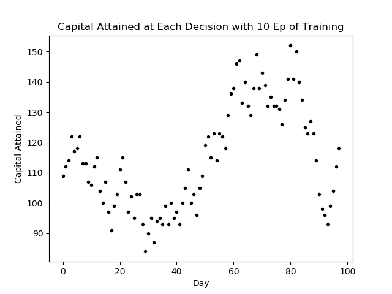
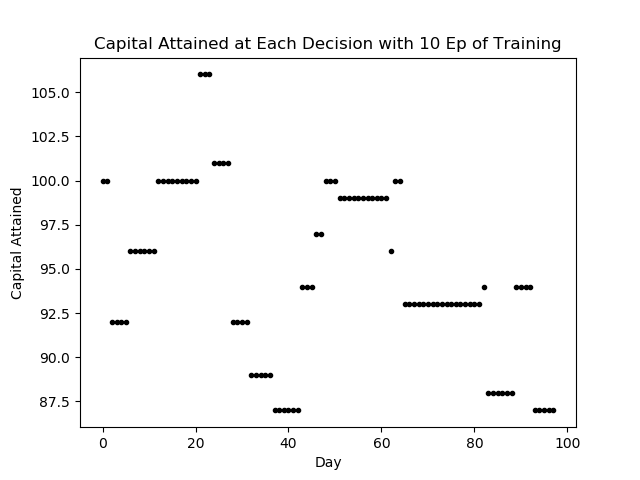
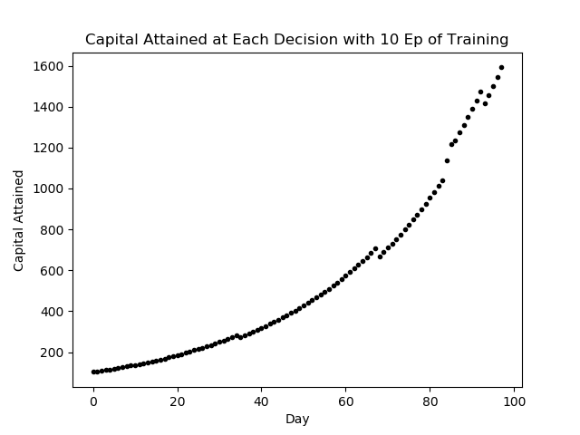
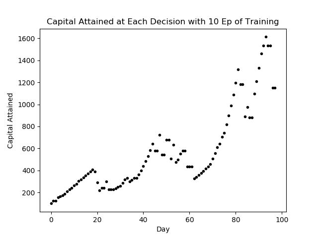
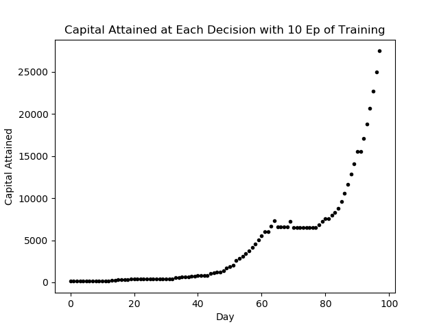

# Reinforcement Learning for Algorithmic Trading

## Getting Started
**Python 3.6.5**    

I would reccomend creating a virtual enviorment, name it `env` so it is included already in the .gitignore file.  
You can create a virtual enviorment using [Virtualenv]("https://virtualenv.pypa.io/en/latest/") if you don't already have it installed in your current python interpreter.  The current dependancies are in `requirements-cpu.txt` or gpu equivalent, and can be installed by the following commands.  
```
pip3 install virtualenv
python3 -m virtualenv env

source env/bin/activate

pip install -r requirements-cpu.txt
```  
The equivalent requirements for gpu support are inside `requirements-gpu.txt` but this isn't necessary until (if) TensorFlow is introduced.  
## Training
Once the enviorment is configured, run `main.py`.  This will train the Q learning agent and plot some results.  An overview of the code architechure is found below.  
* `main.py`
  * This is where you can specify episodes and initial investment
* `enviorment.py`
  * Here you can manipulate action space, observation space, reward function and done done flag
* `Q_table.py`
  * This class defines learning rate, gamma, epsilon parameters and contains choose action and learning methods
* `utils.py`
  * A series of methods used to import and process data  

## Q Learning Results
Experimenting with i.i.d and markov sources are shown below.  These experiments are trained and tested on seperate data, each with initial investment $100. For an i.i.d source, you can see Q-Learning is not effective at determining an effective investment policy.  
  
If we introduce a dummy stock, with constant return rate %0 amung i.i.d sources to represent the choice of not investing, the Q-learning table often computes a maximum expected future reward in choosing not to invest.  
  
Similarily, if we introduce a fixed asset, or bond, the Q-learning will often choose to invest in it, rather than the i.i.d return rates.  
  
Consider now the return rates being modeled by a markovian process of memory 1.  As expected, this yeilds better results than the i.i.d process.  
  
And introducing the dummy stock in this procedure representing the action of not investing.  
  
