# Reinforcement Learning for Algorithmic Trading

## Getting Started
**Python 3.6.5**    

I would reccomend creating a virtual enviorment to avoid dependancy issues.
You can create a virtual enviorment using [Virtualenv]("https://virtualenv.pypa.io/en/latest/") if you don't already have it installed in your current python interpreter.  The current dependancies are in `requirements-cpu.txt` or gpu equivalent, and can be installed by the following commands.  
```
pip3 install virtualenv
python3 -m virtualenv env

source env/bin/activate

pip install -r requirements-cpu.txt
```  
The equivalent requirements for gpu support are inside `requirements-gpu.txt`.  
## Training
We are currently working on optimizing the distribution of funds between two assets. You run `python main.py [source type]`, where the source type(s) are as follows:  
* `markov`
  * Markov memory 1 and a fixed asset with return rate 0
* `markov2`
  * Markov memory 2 and a fixed asset with return rate 0 
* `iid`
  * IID uniform random variable and a fixed asset with return rate 0
* `mix`
  * Markov memory 1 and IID uniform r.v 
* `real` 
  * Real data 
 
This will populate the contents of a Q table and display the result of following the policy obtained over 100 intervals of testing data.  An overview of the code architechure is found below.  
* `main.py`
  * This is where you can specify episodes and initial investment
* `enviorment.py`
  * Here you can manipulate paramaters of the trading enviorment such as action space, observation space, reward function and done flag
* `Q_table.py`
  * This class defines learning rate, gamma, epsilon parameters and contains choice action and learning methods
* `utils.py`
  * A series of methods used to import, generate and manipulate data for training
* `/Matlab/`
  * A bunch of matlab scripts that have been used to determine quantizers, empirical distributions and policies.
## Q Learning Results
Below are some observations thus far. Each example is derived with an initial investment of $100 for 10 episodes.
### IID Source
When the input source is an iid random variable uniformly distributed on [-1,1] with steps of 0.2, the Q table is populated as follows. Note that there is no observation space, as return rates are independent.

| Distribution into Source | 0%    | 10%    | 20%   | 30%    | 40%    | 50%    | 60%   | 70%   | 80%    | 90%    | 100%   |
|--------------------------|-------|--------|-------|--------|--------|--------|-------|-------|--------|--------|--------|
| None                     | 0.013 | -0.016 | -0.11 | -0.038 | -0.009 | -0.038 | 0.004 | 0.001 | -0.038 | -0.087 | -0.123 |

Which indicates the best option is to invest %0 of capital into the IID stock at any given time.  
When the input source is an iid random variable uniformly distributed on [0,0.3], the Q table is populated as follows.

| Distribution into Source | 0%      | 10%     | 20%     | 30%     | 40%     | 50%     | 60%     | 70%     | 80%    | 90%     | 100%    |
|--------------------------|---------|---------|---------|---------|---------|---------|---------|---------|--------|---------|---------|
| None                     | 1923.39 | 2243.24 | 2064.73 | 2121.45 | 2028.12 | 2122.95 | 2088.61 | 2155.73 | 2096.5 | 2124.11 | 4931.78 |

Which indicates the best option is to invest all capital into the IID stock at any given time. 

### Markov Memory 1 Source
Here the input source is markovian with the following transition probabilities.  
<p align="center"> 
    
</p>  
  
  
If the possible return rates for the 3 states are -0.2, 0.0, 0.2 the Q table is populated as follows.

| Distribution into Source | 0%      | 10%     | 20%     | 30%     | 40%     | 50%     | 60%     | 70%    | 80%     | 90%     | 100%    |
|--------------------------|---------|---------|---------|---------|---------|---------|---------|--------|---------|---------|---------|
| Prev Value: 0            | 218.074 | 111.159 | 127.127 | 105.276 | 112.809 | 102.041 | 98.145  | 97.792 | 113.613 | 95.798  | 106.162 |
| Prev Value: 0.2          | 181.137 | 191.67  | 261.255 | 187.992 | 172.182 | 179.056 | 223.266 | 186.9  | 182.004 | 217.171 | 629.632 |
| Prev Value: -0.2         | 244.331 | 58.172  | 62.42   | 48.51   | 56.312  | 55.855  | 50.747  | 63.276 | 77.343  | 52.846  | 55.282  |

This deduces the policy that, when the previous value is:
* 0 -> Do not invest
* -0.2 -> Do not invest
* 0.2 -> Invest %100 of capital into stock  

If the return rates for the 3 possible states are -0.1, 0, 0.4, the Q table below is produced.  

| Distribution into Source  | 0%      | 10%     | 20%     | 30%     | 40%     | 50%     | 60%     | 70%     | 80%     | 90%     | 100%    |
|---------------------------|---------|---------|---------|---------|---------|---------|---------|---------|---------|---------|---------|
| Prev Value: -0.1          | 559.623 | 62.7048 | 60.9816 | 68.2782 | 61.0308 | 66.2113 | 58.6067 | 56.0653 | 64.5082 | 60.6457 | 56.6935 |
| Prev Value: 0             | 69.0304 | 72.4873 | 64.9642 | 58.6928 | 61.7887 | 561.144 | 70.8124 | 69.7554 | 66.7248 | 63.1553 | 64.2676 |
| Prev Value: 0.4           | 159.824 | 196.479 | 200.312 | 181.142 | 205.622 | 200.464 | 184.247 | 178.793 | 196.372 | 172.393 | 1281.63 |

This deduces the policy that, when the previous value is:
* 0 -> Invest %50 of capital into stock
* -0.1 -> Do not invest
* 0.4 -> Invest %100 of capital into stock  
This results are consistend with the optimal investement decision derived in the `./Matlab/` scripts, which yields that the Q-learning is working effectivly.  

Using the script `./Matlab/ModelFitting.m` the one step transition matrix for IBM computed over the IBM return rates, (discluding the last 1000 samples for testing).    
<p align="center"> 
    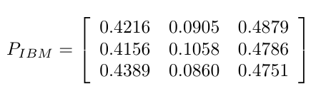
</p>  
For states x < -.1%, -.1% < x < .1% and x > .1%.  
We can then enter this transition matrix and states in `utils.py` to generating 5000 samples, and then train the Q learning agent on these samples.  Applying the policy obtained from Q-learning, we can then apply it to the testing data for IBM (the last 1000 values).  
  
<p align="center"> 
    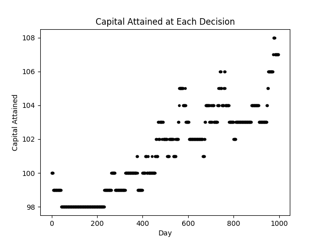
</p>  

However, this quantization is generic and randomly chosen.  Consider now repeating the experiment, however, we can determine the quantization of our training data using the Lloyd Max algorithm on the real data training set.  

<p align="center"> 
    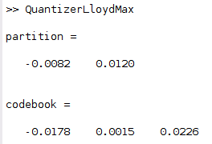
</p>  
Applying this quantiation to `./Matlab/ModelFitting.m` we generate the following transition matrix.  

<p align="center"> 
    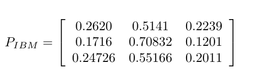
</p>  

Training a Q agent on the dataset generated according to this empirical distribution and applying the policy obtained to the testing data yeilds the following result.  
  
<p align="center"> 
    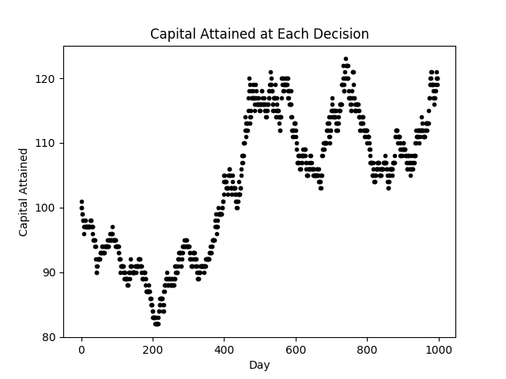
</p>  
Repeating this experiment with the Microsoft data, we first obtain a Llloyd Max quantizatizer as shown below.  
<p align="center"> 
    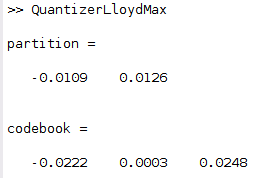
</p>  
Afterwards we can obtain an empiratical approximation of the 1 step transition matrix according to this quantizer, with respect to the MSFT data discluding the most recent 1000 entries.  

<p align="center"> 
    
</p>  
Using this quantizer and transition matrix to generate training data for the Q agent, the policies obtained have the following result on our testing data.  

<p align="center"> 
    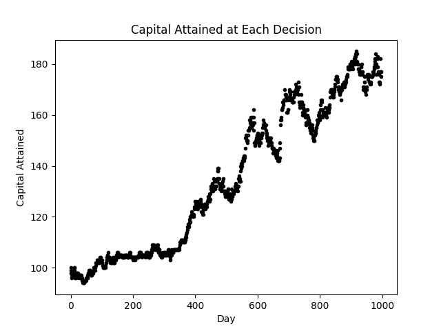
</p>  


### Comparing Q Learning Results for Markov Orders
To better understand what markov order (if any) best represents the conditional dependence of past return rates we experiment with manipulating the obsersvations seen by the Q learning agent. To start, we consider the microsoft data. Below is the populated Q table if this stock is treated as iid. Here, the agent has no access to previous return rates so the observation is always the same.  

| Distribution into Source | 0%      | 10%     | 20%     | 30%     | 40%     | 50%     | 60%     | 70%     | 80%     | 90%    | 100%    |
|--------------------------|---------|---------|---------|---------|---------|---------|---------|---------|---------|--------|---------|
| None                     | 39.2431 | 39.5498 | 39.2918 | 40.3238 | 39.5636 | 48.7792 | 39.8656 | 39.8663 | 39.4475 | 39.746 | 39.4284 |  


This policy implies investing %90 of assets into the stock for any given time step. Applying such policy over the testing data yeilds.  
<p align="center"> 
    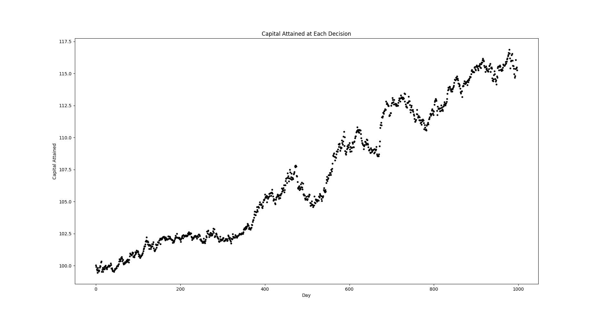
</p>  
Now, if we allow the Q learning agent to observe the previous return rate as `-1, 0, 1` correspoding to being in the negative interval, nuetral interval and positive interval as per the uniform quantization over the training data, we observe the following markov order 1 policy from the Q learning agent.  

| Distribution into Source | 0%      | 10%     | 20%     | 30%     | 40%     | 50%     | 60%     | 70%     | 80%     | 90%     | 100%    |
|--------------------------|---------|---------|---------|---------|---------|---------|---------|---------|---------|---------|---------|
| Prev "Down"              | 8.69687 | 8.416   | 8.76448 | 8.32668 | 8.06351 | 8.44431 | 8.61975 | 19.2718 | 9.00001 | 7.86183 | 7.99984 |
| Prev "Nuetral"           | 21.6007 | 21.3949 | 21.1213 | 21.2595 | 21.0212 | 21.3045 | 20.5782 | 21.1772 | 20.8734 | 28.6595 | 21.2023 |
| Prev "Positive"          | 8.626   | 8.10509 | 18.6383 | 8.12764 | 8.08328 | 8.12089 | 7.71774 | 8.01588 | 8.39773 | 8.66198 | 8.14364 |  
  
This markov policy yeilds the following performance over the testing data.  

<p align="center"> 
    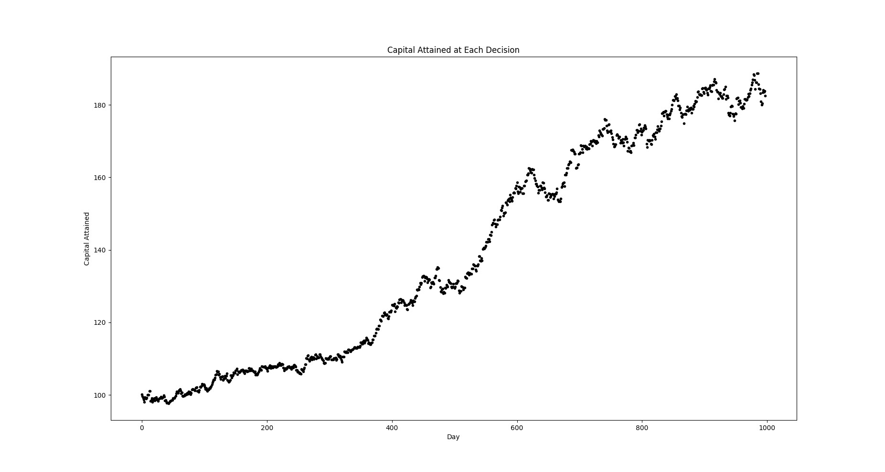
</p>  

Allowing the Q agent to look at the previous two return rates yeilds the following Q table.  

| Distribution into Source         | 0%      | 10%     | 20%     | 30%     | 40%     | 50%     | 60%     | 70%     | 80%      | 90%     | 100%    |
|----------------------------------|---------|---------|---------|---------|---------|---------|---------|---------|----------|---------|---------|
| Prev Seq: "Down", "Down"         | 1.46329 | 1.34375 | 1.31343 | 1.51526 | 1.36004 | 1.47882 | 4.51021 | 1.35624 | 1.63156  | 1.34464 | 1.29957 |
| Prev Seq: "Down", "Nuetral"      | 4.35364 | 4.07422 | 3.88701 | 4.19443 | 4.04607 | 3.83908 | 4.51836 | 4.09829 | 10.6058  | 3.95363 | 4.04416 |
| Prev Seq: "Down", "Positive"     | 1.16335 | 1.42665 | 1.21431 | 1.37276 | 1.42155 | 1.41948 | 1.36941 | 4.42286 | 1.15609  | 1.05923 | 1.19335 |
| Prev Seq: "Nuetral", "Down"      | 2.88785 | 2.68302 | 3.32496 | 2.92446 | 2.70594 | 2.6983  | 2.91641 | 2.71681 | 7.94342  | 3.07691 | 2.84623 |
| Prev Seq: "Nuetral", "Nuetral"   | 15.2012 | 15.0627 | 22.1063 | 14.9272 | 14.9772 | 15.1129 | 14.9588 | 14.7254 | 14.772   | 15.2999 | 15.2734 |
| Prev Seq: "Nuetral", "Postive"   | 7.55047 | 3.08106 | 3.07143 | 3.17324 | 2.909   | 3.29652 | 2.78571 | 3.24299 | 3.09982  | 2.82638 | 3.24957 |
| Prev Seq: "Positive", "Down"     | 4.64262 | 1.45491 | 1.49116 | 1.44225 | 1.37647 | 1.39101 | 1.6392  | 1.17189 | 1.3111   | 1.53721 | 1.38324 |
| Prev Seq: "Positive", "Nuetral"  | 3.74981 | 4.25076 | 4.28741 | 9.85611 | 4.12424 | 4.65483 | 4.37102 | 4.29442 | 3.81727  | 4.28817 | 3.76588 |
| Prev Seq: "Positive", "Positive" | 1.22974 | 1.00224 | 1.16756 | 1.04358 | 1.34929 | 1.13015 | 1.25551 | 3.65231 | 0.896386 | 1.18419 | 1.17435 |  

Applying this markov 2 policy to the testing set yeilds 

<p align="center"> 
    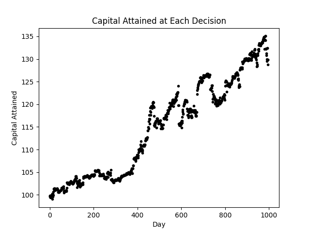
</p>  
Interestingly engough, the seccond order memory performed worse. This is due to Q learning agent not being able to appropriately explore all states.  In order to allow the agent to derive a markov memory 2 policy we must increase the number of training episoides.  
Conducting the equivilant experiment for the IBM data yeilds the following results. When treated as IID, the following Q table is derived.  

| Distribution into Source | 0%      | 10%     | 20%     | 30%     | 40%    | 50%     | 60%     | 70%     | 80%     | 90%     | 100%    |
|--------------------------|---------|---------|---------|---------|--------|---------|---------|---------|---------|---------|---------|
| None                     | 43.8113 | 43.8479 | 43.6593 | 44.0324 | 44.544 | 44.5033 | 43.8169 | 44.1369 | 43.9382 | 54.4591 | 44.3226 |  

And applying such policy to the testing data yeilds.  
<p align="center"> 
    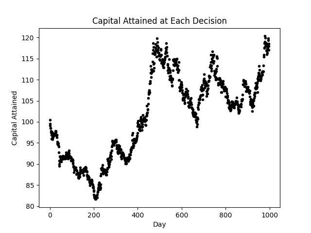
</p>  
Moving to markov memory 1, we obtain the following Q table.  

| Distribution into Source | 0%      | 10%     | 20%     | 30%     | 40%     | 50%     | 60%     | 70%     | 80%     | 90%     | 100%    |
|--------------------------|---------|---------|---------|---------|---------|---------|---------|---------|---------|---------|---------|
| Prev "Down"              | 10.2676 | 10.2352 | 11.1674 | 10.8175 | 10.6088 | 11.0861 | 10.3039 | 22.9233 | 9.90889 | 10.1815 | 9.52493 |
| Prev "Nuetral"           | 23.2557 | 23.2025 | 23.4107 | 23.7157 | 23.1266 | 23.4601 | 31.6622 | 24.0064 | 22.8477 | 23.2966 | 23.6219 |
| Prev "Positive"          | 7.81495 | 7.97147 | 8.75302 | 8.76693 | 8.49904 | 8.13567 | 8.53647 | 8.06919 | 8.06033 | 8.29538 | 20.0326 |  

Which yeilds the following testing results.  
<p align="center"> 
    
</p>  
The difference between the IID test and markov 1 test is that the markov 1 policy seems to be less "risky", it looses less money at the begining of the testing period, however, gains less towards the end.  The two policies appear to be very simaler.  
Moving forward to markov order 2, we obtain the following q table.  

| Distribution into Source         | 0%      | 10%     | 20%     | 30%     | 40%     | 50%      | 60%     | 70%      | 80%     | 90%     | 100%    |
|----------------------------------|---------|---------|---------|---------|---------|----------|---------|----------|---------|---------|---------|
| Prev Seq: "Down", "Down"         | 2.01617 | 2.08723 | 1.95979 | 6.864   | 1.78769 | 1.70395  | 1.87764 | 2.22568  | 1.64296 | 1.81577 | 2.00709 |
| Prev Seq: "Down", "Nuetral"      | 5.53366 | 5.52372 | 5.12495 | 5.09426 | 12.9182 | 5.1679   | 5.40856 | 4.4439   | 4.89715 | 4.97982 | 5.47335 |
| Prev Seq: "Down", "Positive"     | 1.18736 | 1.34069 | 1.44999 | 1.51097 | 1.20899 | 1.38332  | 4.57586 | 1.24534  | 1.38879 | 1.46921 | 1.37788 |
| Prev Seq: "Nuetral", "Down"      | 3.6141  | 3.97473 | 3.66598 | 3.66956 | 3.88415 | 9.45307  | 3.82271 | 3.77226  | 3.98146 | 3.84407 | 3.50747 |
| Prev Seq: "Nuetral", "Nuetral"   | 16.3345 | 16.0558 | 15.8404 | 16.3348 | 15.6925 | 16.4471  | 16.2041 | 16.3338  | 16.1826 | 16.1871 | 24.4097 |
| Prev Seq: "Nuetral", "Postive"   | 3.13525 | 2.72395 | 2.83029 | 3.04262 | 8.08926 | 2.84946  | 3.14385 | 3.14187  | 2.75471 | 2.78054 | 2.84228 |
| Prev Seq: "Positive", "Down"     | 1.49701 | 5.84822 | 1.38522 | 1.58129 | 1.71697 | 1.74671  | 1.58833 | 1.83914  | 1.59212 | 1.92212 | 1.68669 |
| Prev Seq: "Positive", "Nuetral"  | 4.31702 | 3.85078 | 10.0363 | 3.83889 | 3.75574 | 3.99425  | 3.21814 | 4.12956  | 3.47642 | 3.56835 | 3.76362 |
| Prev Seq: "Positive", "Positive" | 1.30869 | 1.09477 | 1.28534 | 1.12935 | 1.18675 | 0.935871 | 0.9024  | 0.860647 | 1.13079 | 1.10643 | 4.14827 |  

Which yeilds the following performance over out testing period.  

<p align="center"> 
    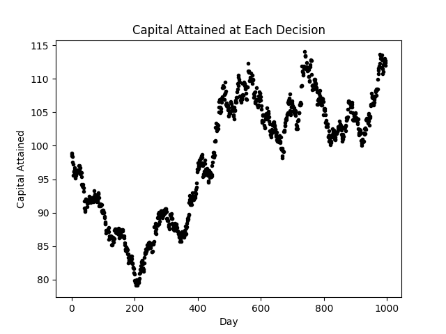
</p>  
