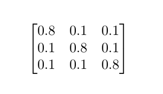

# Reinforcement Learning for Algorithmic Trading

## Getting Started
**Python 3.6.5**    

I would reccomend creating a virtual enviorment to avoid dependancy issues.
You can create a virtual enviorment using [Virtualenv]("https://virtualenv.pypa.io/en/latest/") if you don't already have it installed in your current python interpreter.  The current dependancies are in `requirements-cpu.txt` or gpu equivalent, and can be installed by the following commands.  
```
pip3 install virtualenv
python3 -m virtualenv env

source env/bin/activate

pip install -r requirements-cpu.txt
```  
The equivalent requirements for gpu support are inside `requirements-gpu.txt`.  
## Training
We are currently working on optimizing the distribution of funds between two assets. You run `python main.py [souce type]`, where the source type(s) are as follows:  
* `markov`
  * Markov memory 1 and a fixed asset with return rate 0
* `markov2`
  * Markov memory 2 and a fixed asset with return rate 0 
* `iid`
  * IID uniform random variable and a fixed asset with return rate 0
* `mix`
  * Markov memory 1 and IID uniform r.v 
* `real` 
  * Real data 
 
This will populate the contents of a Q table using an epsilon greedy stratedgy and plot the result of following the policy obtained from Q Learning on a new trading enviorment over 100 intervals of testing data.  An overview of the code architechure is found below.  
* `main.py`
  * This is where you can specify episodes and initial investment
* `enviorment.py`
  * Here you can manipulate paramaters of the trading enviorment such as action space, observation space, reward function and done flag
* `Q_table.py`
  * This class defines learning rate, gamma, epsilon parameters and contains choice action and learning methods
* `utils.py`
  * A series of methods used to import, generate and manipulate data for training

## Q Learning Results
Below are some observations thus far. Each example is derived with an initial investment of $100 for 10 episodes.
### IID Source
When the input source is an iid random variable uniformly distributed on [-1,1] with steps of 0.2, the Q table is populated as follows. Note that there is no observation space, as return rates are independent.

| Distribution into Source | 0%    | 10%    | 20%   | 30%    | 40%    | 50%    | 60%   | 70%   | 80%    | 90%    | 100%   |
|--------------------------|-------|--------|-------|--------|--------|--------|-------|-------|--------|--------|--------|
| None                     | 0.013 | -0.016 | -0.11 | -0.038 | -0.009 | -0.038 | 0.004 | 0.001 | -0.038 | -0.087 | -0.123 |

Which indicates the best option is to invest %0 of capital into the IID stock at any given time.  
When the input source is an iid random variable uniformly distributed on [0,0.3], the Q table is populated as follows.

| Distribution into Source | 0%      | 10%     | 20%     | 30%     | 40%     | 50%     | 60%     | 70%     | 80%    | 90%     | 100%    |
|--------------------------|---------|---------|---------|---------|---------|---------|---------|---------|--------|---------|---------|
| None                     | 1923.39 | 2243.24 | 2064.73 | 2121.45 | 2028.12 | 2122.95 | 2088.61 | 2155.73 | 2096.5 | 2124.11 | 4931.78 |

Which indicates the best option is to invest all capital into the IID stock at any given time. 

### Markov Memory 1 Source
Here the input source is markovian with the following transition probabilities.  
<p align="center"> 
    
</p>  
  
  
If the possible return rates for the 3 states are -0.2, 0.0, 0.2 the Q table is populated as follows.

| Distribution into Source | 0%      | 10%     | 20%     | 30%     | 40%     | 50%     | 60%     | 70%    | 80%     | 90%     | 100%    |
|--------------------------|---------|---------|---------|---------|---------|---------|---------|--------|---------|---------|---------|
| Prev Value: 0            | 218.074 | 111.159 | 127.127 | 105.276 | 112.809 | 102.041 | 98.145  | 97.792 | 113.613 | 95.798  | 106.162 |
| Prev Value: 0.2          | 181.137 | 191.67  | 261.255 | 187.992 | 172.182 | 179.056 | 223.266 | 186.9  | 182.004 | 217.171 | 629.632 |
| Prev Value: -0.2         | 244.331 | 58.172  | 62.42   | 48.51   | 56.312  | 55.855  | 50.747  | 63.276 | 77.343  | 52.846  | 55.282  |

This deduces the policy that, when the previous value is:
* 0 -> Do not invest
* -0.2 -> Do not invest
* 0.2 -> Invest %100 of capital into stock  

If the return rates for the 3 possible states are -0.1, 0, 0.4
