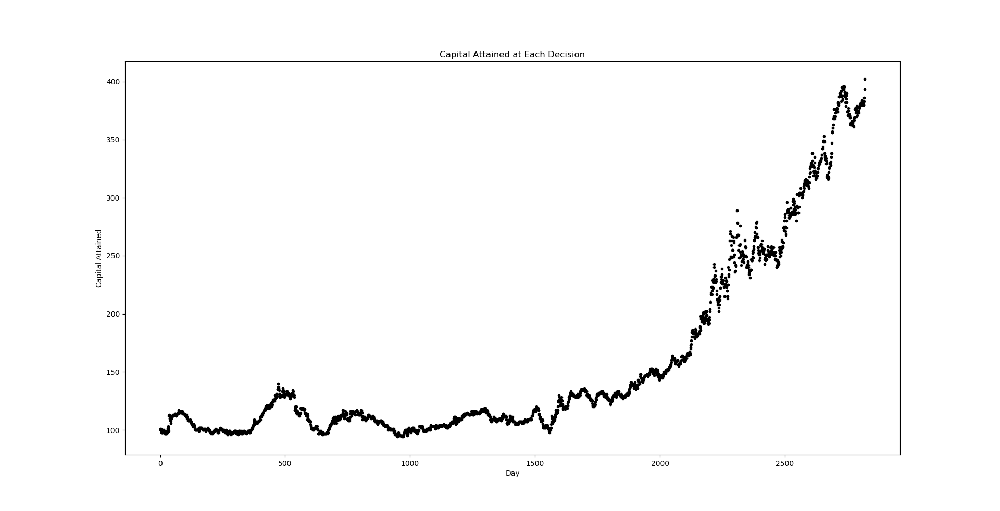

# Reinforcement Learning for Algorithmic Trading

## Getting Started
**Python 3.6.5**    

I would reccomend creating a virtual enviorment, name it `env` so it is included already in the .gitignore file.  
You can create a virtual enviorment using [Virtualenv]("https://virtualenv.pypa.io/en/latest/") if you don't already have it installed in your current python interpreter.  The current dependancies are in `requirements-cpu.txt` or gpu equivalent, and can be installed by the following commands.  
```
pip install virtualenv
virtualenv env

source activate env

pip install -r requirements-cpu.txt
```  
The equivalent requirements for gpu support are inside `requirements-gpu.txt` but this isn't necessary until TensorFlow is introduced (deep Q - learning? wink wink nudge nudge).  
## Training
Once the enviorment is configured, run `main.py`.  This will train the Q learning agent and plot some results.  An overview of the code architechure is found below.  
* `main.py`
  * This is where you can specify episodes and initial investment
* `enviorment.py`
  * Here you can manipulate action space, observation space, reward function and done done flag
* `Q_table.py`
  * This class defines learning rate, gamma, epsilon parameters and contains choose action and learning methods
* `utils.py`
  * A series of methods used to import and process data  

Here is an example graph, where the initial investment was set at $100 and the resulting capital obtained at each decision made by the agent is plotted.  

